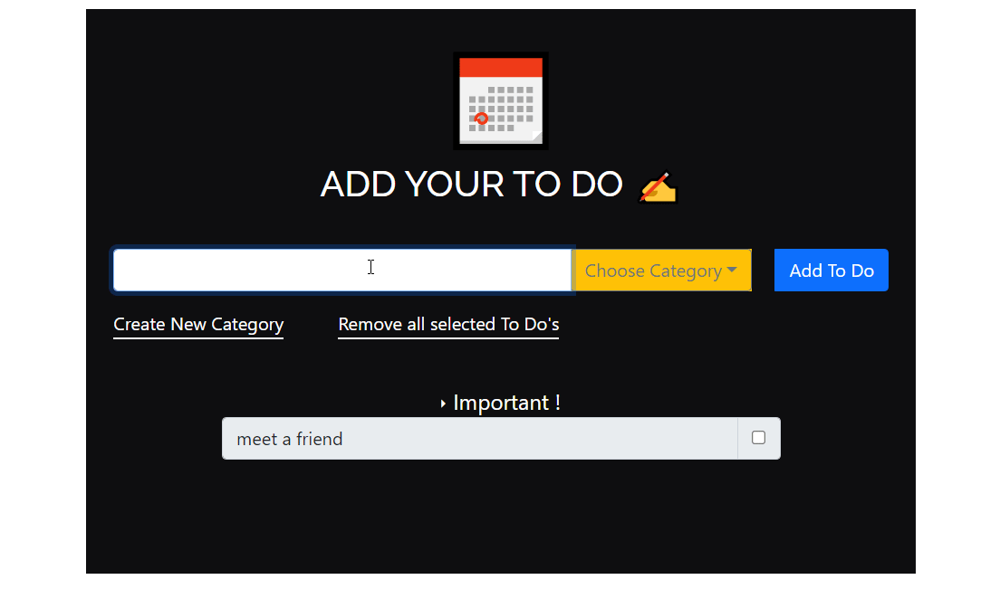

# Technology used

HTML, CSS, JavaScript, React.js,React Hooks Router, Grid System of Bootstrap, Local Storage as local database:).

## Project Details

### Purpose to Make Calculator

:ballot_box_with_check:A to-do app can be a great reminder or starting point when it comes to CRUD in web development. Being able to read information, create new information, update existing information, and delete information can be powerful in any application.

:ballot_box_with_check:To Do application will need to display the tasks, add new tasks under different categories, create categories, multiple select and remove tasks. These actions will touch upon the four aspects of a CRUD (Create, Read, Update, and Delete) application.

:ballot_box_with_check:In software development, a user story is an actionable goal from the perspective of the user. Defining user stories before we begin our work will help us focus our work. Our app should fulfill the following stories:
As a user, I can:
> Read a list of tasks.
> Add a task using the mouse or keyboard.
> Delete any task, using the mouse or keyboard.
> View a specific subset of tasks.
> View tasks based on categories.
> Able to create new categories.

### What i have learned

#### :black_nib:Interactions with UI and key JavaScript methods.
#### :black_nib:Working with user events and state to create interactive applications.
#### :black_nib:How to work with lists and conditional content.
#### :black_nib:React Hooks (in-depth)! ex. useSelector , useState, useEffect, useDispatch etc.
#### :black_nib:Class-based components and functional components.
#### :black_nib:I am going to keep our list in localstorage, so I started with a simple interface for working with tasks and localstorage. I stored our tasks in an array of objects.
#### :black_nib:Routing with React Router.
#### :black_nib:How to use Grid System of Bootstrap or React-Bootstrap
#### :black_nib:Amazing things and learning a lot along on the way.

